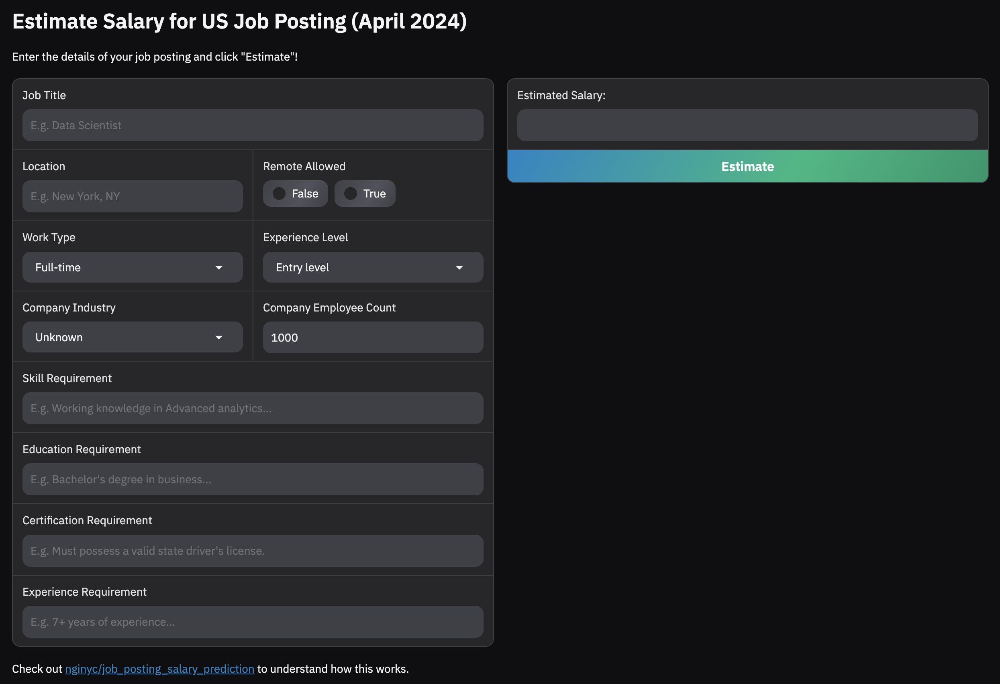
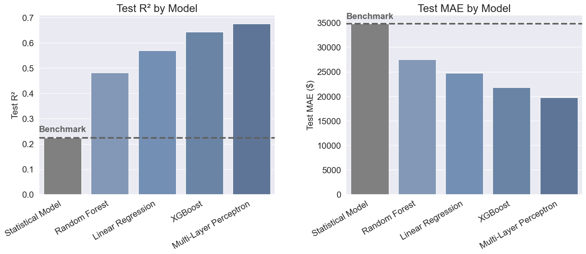

# 💰 Job Posting Salary Prediction

## Introduction

This project aims to build a Machine Learning (ML) model for salary benchmarking. It estimates a job's salary given the job's details such as job title, location and job description. 

This easily beats basic statistical methods, such as aggregating salaries by job title and location, since the ML model additionally considers more granular characteristics like skill and certification requirements, the company's industry, etc.

The ML model is trained on [the US LinkedIn Job Postings Kaggle dataset](https://www.kaggle.com/datasets/arshkon/linkedin-job-postings). The latest data is dated **April 2024**.

Try out our best performing model deployed on [this Hugging Face space 🤗](https://huggingface.co/spaces/nginyc/job_posting_salary_prediction_app)



## Project Description

### 🤖 ML Problem Definition

We formulate this as a **regression** problem to predict a continuous salary value based on a list of job attributes. Job attributes include:
- **Job title** (e.g. "Marketing Coordinator")
- **Location** (e.g. "San Jose, CA"), including *remote work availability*
- **Work type** (e.g. "full-time," "part-time," and "internship")
- **Experience level** (e.g. "entry-level" and "mid-senior level")
- **Company's industry** (e.g. "Construction" and "Banking")
- **Company's location** (e.g. "Jersey City, NJ in US")
- **Company's employee count**
- **Job description**, which embeds finer job details such as skill and certification requirements, etc

In particular, we use [the US LinkedIn Job Postings Kaggle dataset](https://www.kaggle.com/datasets/arshkon/linkedin-job-postings) for training and evaluation. Each US job posting in the dataset is an example, and we aim to predict its `normalized_salary`, an annualized estimate of the salary that the company had indicated on the LinkedIn job posting. 

We evaluate model performance on **10,000 labelled test examples** using the following two metrics:
- **Mean Absolute Error (MAE)** e.g. "our predicted salaries are $50,000 off on average"
- **Coefficient of Determination (R<sup>2</sup>)** e.g. "our model explains 50% of the variance in salaries"

### 🧹 Dataset Cleaning

To arrive at the clean labelled dataset, we apply the following filters on the original dataset:
1. Job posting is not duplicated
2. Job posting has an indicated salary
3. Job posting's salary is in USD 
4. Job posting's salary is at least 10K USD annually (not too low)
5. Job posting's salary is at most 1M USD annually (not too high)
6. Job posting's salary range spread is not more than 4X (range not too wide)

After dataset cleaning, we have **34,705 clean labelled examples** for training and evaluation, from which we carve 10,000 test examples for evaluating test performance. We also keep 84,517 clean *unlabelled* examples for training.

### 🔄 Data Preprocessing

#### LLM Information Extraction from Job Description

We use a Large Language Model (LLM) – namely **Gemini 2.0 Flash Lite** – to extract more fine-grained attributes from the long text job description (JD). Specifically, we extracted these attributes if they were specified in the JD:
- **Experience requirement**: Required or preferred years and types of experience (e.g. "Custodial experience is preferred but not required")
- **Skill requirement**: Required or preferred technical skills and soft skills (e.g. "In-depth knowledge of General Ledger Accounting, Rates and Compliance, and Cost Proposal functions")
- **Education requirement**: Required or preferred educational qualifications (e.g. "BS in computer science")
- **Certification requirement**: Required or preferred certifications (e.g. "Certified Public Accountant or Certified Management Accountant designation is preferred")
- **Min and max salary**: Indicative minimum and/or maximum salary value
- **Single-point salary**: Single indicative salary value
- **Pay period**: Pay period associated with the provided salary figure

Extracted experience, skill, education and certification requirements are used, instead of JD, as input features to ML models for this regression task.

On the other hand, the extracted salary attributes are used to *backfill* `normalized_salaries` in unlabelled examples, expanding our labelled dataset for training from 24,705 to 32,103 examples (~30% more).

Refer to [`preprocess_dataset.ipynb`](./preprocess_dataset.ipynb) for the exact LLM prompt and code used for information extraction. 

#### Text Encoding with SBERT Embeddings

Besides one-hot encoding, we additionally encode text attributes as [SBERT embeddings](https://sbert.net/index.html#) – specifically the `all-MiniLM-L6-v2` model with 384 dimensions.

The SBERT-encoded text attributes are:
- Job title, location, and company's industry
- Extracted experience, skill, education and certification requirements

### 📊 Modelling and Results

#### Statistical Model as Benchmark

As a baseline for comparison, we evaluate the performance of simple statistical models that simply predict the mean or median salary based on job title and/or location. In cases where data is missing, the model falls back to using global means or medians. LLM-extracted backfilled salaries are not used for this benchmark.

| Model Variant                        | Test R²   | Test MAE   |
|--------------------------------------|-----------|------------|
| Mean Salary by Title                 | 0.2231 | $34,806 |
| Mean Salary by Title and Location    | 0.2217 | $34,789 |
| Median Salary by Title               | 0.1763 | $34,139 |
| Median Salary by Title and Location  | 0.1761 | $34,113 |

Based on R², the best model variant is "Mean Salary by Title" with a test R² of 0.2231 and a test MAE of $34,806.

Code: [`evaluate_stats_models.ipynb`](./evaluate_stats_models.ipynb).

#### Linear Regression

We explore linear regression models with L1 regularization (Lasso), L2 regularization (Ridge) and ElasticNet regularization as variants. Hyperparameter tuning is performed using [Bayesian optimization](https://scikit-optimize.github.io/stable/modules/generated/skopt.BayesSearchCV.html).

| Model Variant | Test R² | Test MAE | Best Hyperparameters |
|-------|---------|----------|----------------------|
| L1 regularization | 0.5704 | $24,732 | `{ 'alpha': 87.145 }` |
| L2 regularization | 0.5680 | $25,113 | `{ 'alpha': 1000.0 }` |
| ElasticNet regularization | 0.5703 | $24,611 | `{ 'alpha': 0.32865, 'l1_ratio': 0.48027 }` |

Based on R², the best model variant is "L1 regularization" with a test R² of 0.5704 and a test MAE of $24,732.

Code: [`train_linear_model.ipynb`](./train_linear_model.ipynb).

#### Random Forest

We explore tuning a random forest using [Bayesian optimization](https://scikit-optimize.github.io/stable/modules/generated/skopt.BayesSearchCV.html).

| Test R² | Test MAE | Best Hyperparameters |
|---------|----------|----------------------|
| 0.4827 | $27,512 | `{ "max_depth": 20, "max_features": "sqrt", "min_samples_leaf": 1, "min_samples_split": 2, "n_estimators": 194 }` |

Code: [`train_random_forest.ipynb`](./train_random_forest.ipynb)

#### XGBoost

We explore tuning a XGBoost model using [Bayesian optimization](https://scikit-optimize.github.io/stable/modules/generated/skopt.BayesSearchCV.html).

| Test R² | Test MAE | Best Hyperparameters |
|---------|----------|----------------------|
| 0.6430 | $21,779 | `{ "colsample_bytree": 0.1, "eta": 0.0628, "gamma": 1, "max_depth": 10, "min_child_weight": 100, "n_estimators": 1000, "objective": "reg:squarederror", "subsample": 1.0 }` |

Code: [`train_xgboost.ipynb`](./train_xgboost.ipynb)

#### Multi-Layer Perceptron

We explore tuning a Multi-Layer Perceptron (MLP) using [Bayesian optimization](https://scikit-optimize.github.io/stable/modules/generated/skopt.BayesSearchCV.html). As part of the tuning, feed-forward neural architectures of 1, 2, 3 and 4 hidden layers are explored.

| Test R² | Test MAE | Best Hyperparameters |
|---------|----------|----------------------|
| 0.6726 | $20,142 | `{'lambda1': 0.0001, 'lr': 0.00447, 'batch_size': 128, 'module__num_hidden_layers': 3, 'module__n_units_last': 256, 'module__dropout_rate': 0.5}` |

Code: [`train_multi_layer_perceptron.ipynb`](./train_multi_layer_perceptron.ipynb), [`multi_layer_perceptron.py`](./multi_layer_perceptron.py)

### 🏆 Summary of Results

Below is a comparison of the test performance across the different models.

| Model | Test R² | Test MAE |
|-------|---------|----------|
| Statistical Model | 0.2231 | $34,806 |
| Linear Regression | 0.5704 | $24,732 |
| Random Forest | 0.4827 | $27,512 |
| XGBoost | 0.6430 | $21,779 |
| Multi-Layer Perceptron | 0.6726 | $20,142 |



The best performing model is the **Multi-Layer Perceptron**, with a **test R² of 0.6726** and estimating salaries that are **$20,142 off** on average, a **42.1% reduction in mean absolute error** compared to basic statistical methods. 

The next best performing model is **XGBoost** with a **test R² of 0.6430** and a **test MAE of $21,779**, a **37.4% reduction** compared to basic statistical methods. 

The results successfully demonstrate the usefulness of ML to more accurately estimate US job salaries.

## Replicating the Results 

### Setting Up the Project

To set up your Python environment, you can use [pyenv](https://github.com/pyenv/pyenv) e.g. run the following:
```sh
pyenv install
pyenv exec python -m venv ./venv
source ./venv/bin/activate
```

Install the project's dependencies:
```sh
pip install -r requirements.txt
```

Duplicate the file `.env.template` as `.env` and populate it with [your Gemini API key](https://ai.google.dev/gemini-api/docs/pricing).

### Doing Feature Preprocessing

Run the notebooks in the following order:

1. `export_dataset.ipynb` reads original dataset from Kaggle and exports the raw dataset to `data/jobs.csv`
2. `clean_dataset.ipynb` reads from `data/jobs.csv`, filters, cleans and pre-processes the dataset for our problem statement and exports the clean data to `data/jobs_clean.csv`
3. `preprocess_dataset.ipynb` reads from `data/jobs_clean.csv`, preprocesses data and exports the processed data to `data/jobs_processed.csv`. The processing performs LLM-based information extraction and will take a while, but it can be safely interrupted and resumed at any point as progress is saved to `data/extracted_job_attributes.csv`
4. `split_dataset.ipynb` reads from `data/jobs_processed.csv` and splits it into train and test dataset at `data/jobs_train.csv` and `data/jobs_test.csv`

Instead of running the notebooks, you can also download some of the output datasets here: 
- [`data/jobs_train.csv`](https://drive.google.com/file/d/11Mb5HPoObsP8xnFKT0KI27e084-HrjHO/view?usp=sharing)
- [`data/jobs_test.csv`](https://drive.google.com/file/d/1gLJL5LXqwOfYDJZKOZkrJz1r9CBG2DWu/view?usp=sharing)
- [`data/extracted_job_attributes.csv`](https://drive.google.com/file/d/18vAr_RlSYLVXZZnTb3wnvHmx3SO5yfbp/view?usp=sharing)

### Doing Exploratory Data Analysis (EDA)

The notebook `explore_dataset.ipynb` does EDA on `data/jobs.csv`. For example, it illustrates how we arrived at our data cleaning filters.

### Training Models

The following model training notebooks use `data/jobs_train.csv` and `data/jobs_test.csv` to train and evaluate different models:
  - `evaluate_stats_models.ipynb`
  - `train_linear_model.ipynb`
  - `train_random_forest.ipynb`
  - `train_xgboost.ipynb`
  - `train_multi_layer_perceptron.ipynb`

Options on how to run the notebooks:
- Run it in Visual Studio Code
- Run `jupyter lab`
- Run `bash run_notebook.sh <notebook_name>.ipynb`

## Credits

Credits to [Arsh Koneru](https://www.kaggle.com/arshkon) and [Zoey Yu Zou](https://www.kaggle.com/zoeyyuzou) on Kaggle for scraping the original LinkedIn Job postings data! 🙏 